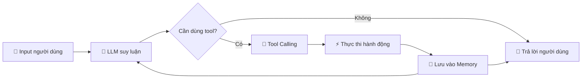
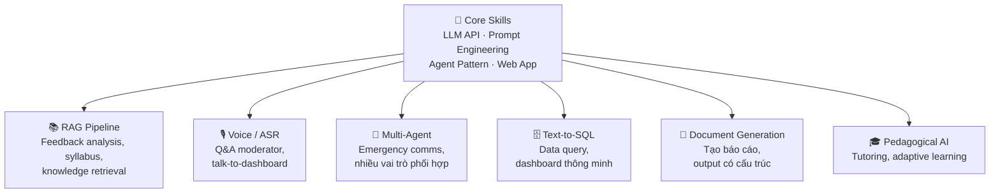
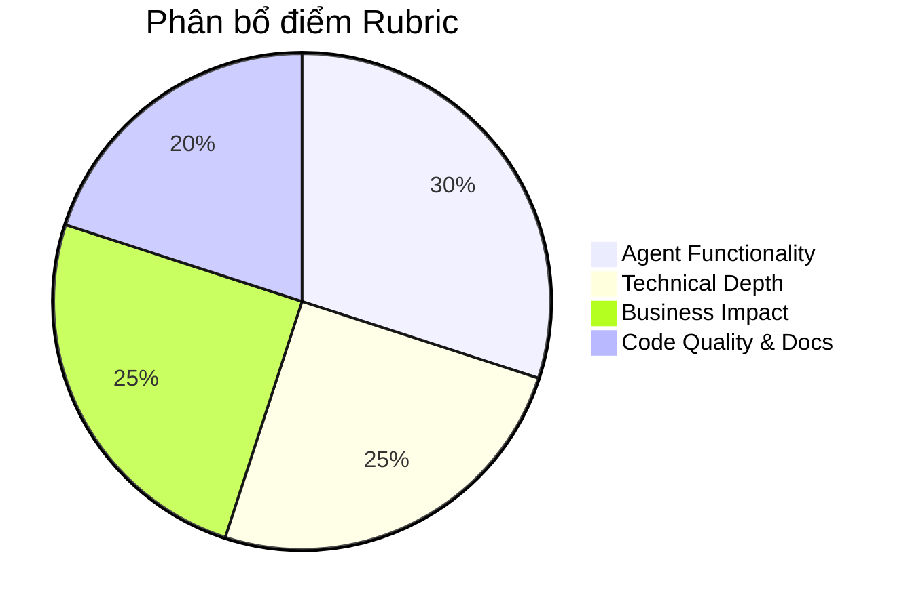

# Roadmap Kỹ Năng — A20 Build Phase

> Các bạn đang xây một **sản phẩm AI Agent** trong 7 tuần. Không phải viết báo cáo, không phải làm bài tập — mà là ship một sản phẩm chạy được. Bài viết này giúp các bạn tự đánh giá mình đang ở đâu và cần bổ sung gì.

---

## 1. Bức tranh tổng quan — Các bạn đang xây cái gì?

Một AI Agent **không phải** chỉ là gọi ChatGPT API rồi hiển thị kết quả. Agent = một hệ thống biết **suy nghĩ, hành động, và học từ kết quả**.



**Công thức đơn giản:**

```
Agent = LLM + Tools + Memory + Logic Loop
```

- **LLM**: Bộ não — hiểu ngữ cảnh, ra quyết định
- **Tools**: Tay chân — gọi API, truy vấn DB, tìm kiếm tài liệu
- **Memory**: Trí nhớ — nhớ context qua các lượt hội thoại
- **Logic Loop**: Vòng lặp plan → execute → validate → recover

Nghĩ như đang xây một "nhân viên ảo" biết làm việc, không phải một chatbox trả lời câu hỏi.

---

## 2. Skill Map — Các kỹ năng cần thiết

### Core Skills (ai cũng cần)

| Kỹ năng | Mô tả ngắn | Ưu tiên |
|---------|------------|---------|
| LLM API Integration | Gọi API, xử lý response, structured output | 🔴 Tuần 1 |
| Prompt Engineering | System prompt, few-shot, chain-of-thought | 🔴 Tuần 1-2 |
| Agent Pattern | Plan → execute → validate → recover loop | 🔴 Tuần 2-3 |
| Web App Basics | Frontend + backend + deploy | 🟡 Tuần 3-4 |

### Domain Skills (tuỳ đề tài)



Gợi ý: không cần học hết — chỉ cần **core + 1-2 domain skills** phù hợp đề tài của nhóm.

---

## 3. Lộ trình theo tuần — Focus vào cái gì, khi nào?

| Tuần | Focus | Kỹ năng chính | Workshop hỗ trợ |
|------|-------|---------------|-----------------|
| **W1-W2** | Hiểu bài toán + First Agent chạy được | LLM API, prompt engineering, basic agent loop | WS1-4 |
| **W3** | Core agent hoạt động ổn định | Tool calling, agent loop hoàn chỉnh, domain skills (RAG/Voice/...) | WS5-6 |
| **W4** | Features + UX | Frontend, conversation UX, bắt đầu evaluation | WS7-8 |
| **W5-W6** | Ship it! | Deploy, guardrails, error handling, demo prep | WS9-12 |
| **W7** | Demo Day | Polish demo, pitch deck, documentation | — |

```mermaid
gantt
    title Skill Progression qua 7 tuần
    dateFormat  X
    axisFormat %s

    section Core
    LLM API + Prompt Eng     :done, 1, 3
    Agent Pattern             :active, 2, 4
    Web App + Deploy          :3, 6

    section Domain
    RAG / Voice / SQL...      :3, 5

    section Ship
    Evaluation + Guardrails   :4, 6
    Demo + Docs               :5, 7
```



**Nguyên tắc:** Tuần 1-2 là nền tảng. Nếu cuối tuần 2 mà chưa gọi được LLM API và chưa có agent loop cơ bản — các bạn đang chậm, cần tăng tốc ngay.

---

## 4. Rubric Alignment — Làm sao để đạt điểm cao?



| Tiêu chí | Trọng số | Các bạn cần thể hiện | Kỹ năng liên quan |
|----------|---------|----------------------|-------------------|
| **Agent Functionality** | 30% | Agent loop hoạt động, tool calling, error handling, agent tự chủ ra quyết định | Agent pattern, tool integration |
| **Technical Depth** | 25% | Dùng đúng AI pattern (RAG, multi-agent...), có evaluation, không chỉ là API wrapper | Domain skills, evaluation |
| **Business Impact** | 25% | Giải quyết vấn đề thật, có số liệu cải thiện, demo thuyết phục | Problem framing, UX |
| **Code Quality & Docs** | 20% | Repo sạch, có architecture diagram, README rõ ràng, journal đầy đủ | Git, documentation |

Gợi ý: Nhiều nhóm mất điểm ở **Technical Depth** vì chỉ dừng ở mức gọi API. Hãy đầu tư vào agent loop thật sự (plan-execute-validate) và evaluation.

---

## 5. Self-Assessment Checklist

Dùng checklist này để tự kiểm tra tiến độ nhóm:

**Nền tảng (W1-W2):**
- [ ] Gọi được LLM API và nhận response thành công?
- [ ] Có system prompt được thiết kế cho bài toán cụ thể?
- [ ] Hiểu rõ bài toán và xác định được user chính?
- [ ] Có architecture diagram (dù đơn giản)?

**Agent Core (W3):**
- [ ] Agent có tool calling (không chỉ chat)?
- [ ] Có vòng lặp plan → execute → validate?
- [ ] Agent xử lý được error / edge case cơ bản?
- [ ] Domain skill hoạt động (RAG/Voice/SQL...)?

**Product (W4-W5):**
- [ ] MVP chạy end-to-end (user input → agent xử lý → output)?
- [ ] Có UI người dùng tương tác được?
- [ ] Deploy lên cloud, có live URL?
- [ ] Có evaluation evidence (agent hoạt động đúng bao nhiêu %)?

**Ship (W6-W7):**
- [ ] README đầy đủ (cách cài, cách chạy, architecture)?
- [ ] Demo video / pitch deck sẵn sàng?
- [ ] Weekly journal + worklog cập nhật?
- [ ] Prompt logs và PR reviews có trong repo?

---

## 6. Tài nguyên gợi ý

Không cần đọc 50 link — dưới đây là những thứ thiết yếu nhất:

### Công cụ xây dựng
| Mục đích | Gợi ý | Ghi chú |
|----------|-------|---------|
| Coding assistant | **Claude Code** / Cursor | Pair-program với AI, tăng tốc đáng kể |
| Quick UI | **Streamlit** / Gradio | Dựng UI prototype trong vài giờ |
| Deploy | **Railway** / Vercel / Render | Free tier đủ cho MVP |
| LLM API | OpenAI / Anthropic / Google | Chọn 1, đừng cố hỗ trợ tất cả |

### Học theo skill
| Skill | Tài nguyên gợi ý |
|-------|------------------|
| Agent Pattern | [LangChain Agent docs](https://python.langchain.com/docs/modules/agents/), [OpenAI Function Calling](https://platform.openai.com/docs/guides/function-calling) |
| RAG | [LlamaIndex starter](https://docs.llamaindex.ai/en/stable/getting_started/starter_example/), Workshop WS5-6 slides |
| Prompt Engineering | [Anthropic Prompt Engineering guide](https://docs.anthropic.com/en/docs/build-with-claude/prompt-engineering/overview), [OpenAI best practices](https://platform.openai.com/docs/guides/prompt-engineering) |
| Deploy | [Railway quickstart](https://docs.railway.com/quick-start), [Vercel docs](https://vercel.com/docs) |

### Từ chương trình
- **Workshop slides & recordings**: Xem lại theo số WS tương ứng mỗi tuần
- **Office Hours** (T2/T5/CN 20:00-21:00): Hỏi trực tiếp coach trên Discord voice
- **Discord async**: Đặt câu hỏi bất kỳ lúc nào, coach và peer sẽ hỗ trợ

---

> **Nhớ:** Chương trình này là về **xây dựng**, không phải học lý thuyết. Cách tốt nhất để học một kỹ năng là dùng nó trong sản phẩm của các bạn. Gặp lỗi → debug → hiểu sâu hơn bất kỳ bài giảng nào. Ship early, ship often.
