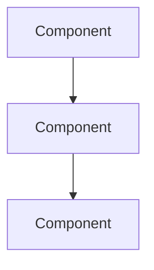

# vibedocs

Write technical documentation following the Vibe Docs Standard — AI-readable, domain-segmented, numbered docs.

## Triggers

- "vibedocs" or "/vibedocs"
- "write docs for this project"
- "create documentation"
- "document this system"
- "restructure docs"

## Workflow

### Step 1: Analyze System

Inventory all concepts by reading:
- README.md
- Main source files
- Existing docs
- Config files (package.json, wrangler.toml, etc.)

List concepts:
```
- HTTP routing
- Authentication
- Database models
- External APIs
- Background jobs
- Deployment
```

### Step 2: Cluster by Domain

Apply the formula: `Domain = Responsibility × Change-frequency × Dependency-level`

Group concepts that:
1. Have ONE clear responsibility
2. Change together
3. Same dependency level

Output domain clusters:
```
00-architecture-overview (system shape)
01-core-flow (main pipeline)
02-api-layer (HTTP, routing)
03-integrations (external services)
...
```

### Step 3: Order by Dependency

- `00` = always architecture overview
- Lower numbers = foundations (break = everything breaks)
- Higher numbers = surface (break = one thing breaks)
- Deployment/operations = last

### Step 4: Create Each Doc

Use this skeleton for EVERY doc:

```markdown
# NN-domain-name

{2-3 sentence overview. What is this? Why does it exist?}

## System Diagram

{Mermaid flowchart showing main concept}



## 1. First Concept

{Explanation with tables}

| Key | Value |
|-----|-------|
| Config | Setting |

## 2. Second Concept

{More content}

## File Reference

| File | Purpose |
|------|---------|
| `src/module.ts` | Implementation |

## Cross-References

| Doc | Relation |
|-----|----------|
| [00-architecture](00-architecture.md) | Parent context |
| [03-related](03-related.md) | Uses this |
```

### Step 5: Create Index

Update or create SITE.md / README.md with doc index:

```markdown
## Documentation

| Doc | Description |
|-----|-------------|
| [00-architecture](docs/00-architecture.md) | System overview |
| [01-core-flow](docs/01-core-flow.md) | Main pipeline |
```

### Step 6: Validate

Checklist:
- [ ] Each doc has 2-3 sentence overview?
- [ ] Each doc has Mermaid diagram?
- [ ] No constants buried in prose (use tables)?
- [ ] All docs have File Reference?
- [ ] All docs have Cross-References?
- [ ] Index updated?

## Document Rules

### Structure Rules

1. **Overview first** — 2-3 sentences, no fluff
2. **Mermaid second** — visualize before explain
3. **Tables for data** — never bury config in prose
4. **Numbered sections** — enable precise references
5. **File Reference** — map docs to code
6. **Cross-References** — link related docs

### Writing Rules

1. **One responsibility per doc** — can describe in one sentence without "and"
2. **Consistent terminology** — never synonym-switch ("worker" not "service/handler/processor")
3. **Code identifiers in backticks** — `functionName()`, `src/file.ts`
4. **Active voice** — "The worker processes" not "Messages are processed by"
5. **No filler** — cut "In order to", "It should be noted that", "As mentioned above"

### Sizing Rules

| Doc Type | Target | Max |
|----------|--------|-----|
| Overview | 500-800 tokens | 1000 |
| Core system | 800-1200 tokens | 1500 |
| Reference | 1000-1500 tokens | 2000 |

### Diagram Rules

| Concept | Diagram Type |
|---------|--------------|
| System components | `flowchart TB` |
| Request flow | `sequenceDiagram` |
| State transitions | `stateDiagram-v2` |
| Data relationships | `erDiagram` |

## Decision Heuristics

When unsure where content belongs:

1. **Change Question**: "If I change X, what else changes?" → same doc
2. **Break Question**: "If X breaks, what else breaks?" → determines number
3. **Explain Question**: "Can I explain in 3 minutes?" → if no, split
4. **Find Question**: "Where would someone look?" → match mental model

## Anti-Patterns to Avoid

| Pattern | Why Bad | Do Instead |
|---------|---------|------------|
| By file type (models.md) | Mixes concerns | By responsibility |
| Alphabetical order | No learning path | Dependency order |
| One mega-doc | Can't find anything | 8-15 focused docs |
| Prose-heavy | Hard to scan | Tables + diagrams |
| No cross-refs | Dead ends | Link everything |

## Example Output

For a typical web app, create:

```
docs/
├── 00-architecture-overview.md
├── 01-request-flow.md
├── 02-api-layer.md
├── 03-auth-system.md
├── 04-database.md
├── 05-background-jobs.md
├── 06-integrations.md
├── 07-frontend.md
├── 08-deployment.md
└── SITE.md (index)
```

## Reference

Full standard documentation: `/Applications/MAMP/htdocs/vibelabs/vilab/docs/09-vibe-docs-standard.md`

Formula: `Domain = Responsibility × Change-frequency × Dependency-level`
